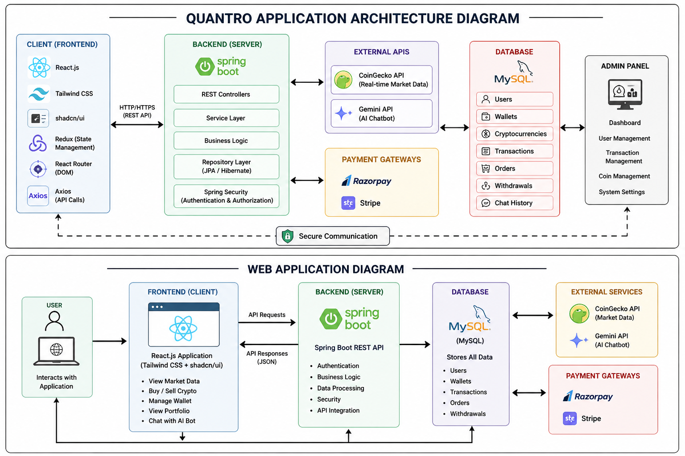
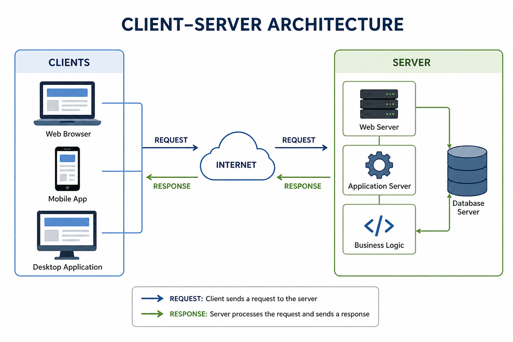
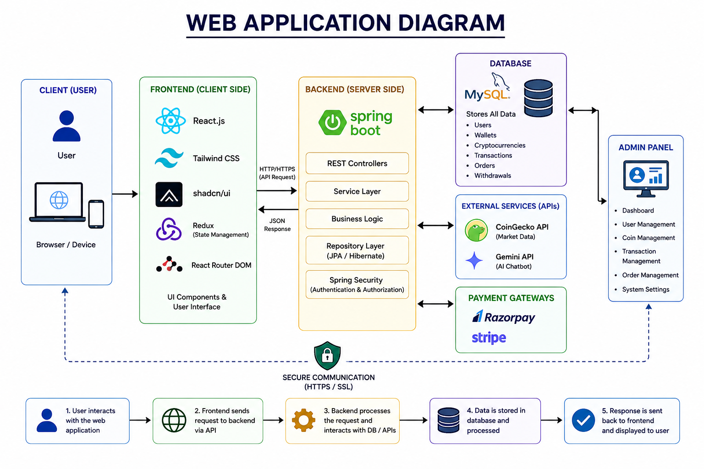
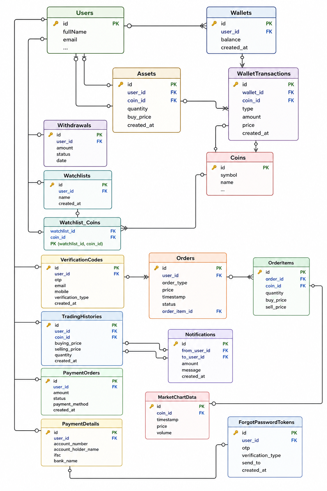

# Quantro Trading Application

A modern and secure cryptocurrency trading platform that enables users to buy, sell, manage, and track digital assets in real-time. The platform integrates AI-powered assistance, secure wallet management, advanced authentication, and seamless payment gateways to deliver a complete crypto trading experience.

---

# Features

## AI Chat Bot
An intelligent AI-powered chatbot integrated using Gemini API and CoinGecko API to provide:

- Real-time cryptocurrency prices
- Market trends and insights
- Coin-related queries
- Trading assistance
- Crypto market data analysis

---

## Buy & Sell Crypto
A seamless and user-friendly trading interface allowing users to:

- Buy cryptocurrencies instantly
- Sell digital assets securely
- Access live market prices
- Trade multiple cryptocurrencies

---

## Portfolio Management
Advanced portfolio management tools to help users:

- Track investment performance
- Monitor profit and loss
- View total portfolio balance
- Analyze market movements

---

# Advanced Wallet Functionality

## Wallet to Wallet Transfer
- Secure crypto transfer between users
- Instant transaction processing
- Real-time balance updates

## Withdrawal to Bank Account
- Withdraw wallet balance directly to bank accounts
- Secure payment verification
- Fast transaction processing

## Add Balance to Wallet
- Add funds securely using payment gateways
- Smooth deposit experience
- Instant wallet updates

---

# Transaction History

## Withdrawal History
- View previous withdrawals
- Track withdrawal status
- Monitor transaction records

## Wallet History
- Complete transaction logs
- Deposit and transfer history
- Detailed wallet activity tracking

---

# Search Coin Functionality
Users can easily search for cryptocurrencies and access:

- Live prices
- Market capitalization
- Trading volume
- Coin details and trends

---

# Authentication & Security

## Login & Register
- Secure user authentication system
- Encrypted password management
- User session handling

## Two-Factor Authentication (2FA)
- Extra layer of account protection
- OTP verification system
- Improved account security

## Forgot Password
- Password recovery via email
- Secure reset token mechanism
- User-friendly recovery process

---

# Technology Stack

## Backend Technologies

| Technology | Description |
|------------|-------------|
| Spring Boot | Backend application framework |
| Spring Security | Authentication & authorization |
| MySQL | Relational database management |
| Java Mail Sender | Email and OTP services |

---

## Frontend Technologies

| Technology | Description |
|------------|-------------|
| React | Frontend UI library |
| Tailwind CSS | Utility-first CSS framework |
| Redux | State management |
| Axios | API handling |
| React Router DOM | Client-side routing |
| Shadcn UI | Modern UI components |

---

# Payment Gateways

## Razorpay
- Secure Indian payment gateway integration
- Wallet recharge and transactions

## Stripe
- Global payment processing
- Secure online payment handling

---

# APIs Used

| API | Purpose |
|-----|---------|
| Gemini API | AI chatbot integration |
| CoinGecko API | Real-time crypto market data |

---

# Core Functional Modules

- User Authentication Module
- Crypto Trading Module
- Wallet Management Module
- Portfolio Tracking Module
- AI Chat Assistant Module
- Transaction History Module
- Payment Gateway Integration
- Security & Verification Module

---

# Key Highlights

- Real-Time Crypto Data
- AI-Powered Chat Support
- Secure Wallet Transactions
- Modern Responsive UI
- Scalable Backend Architecture
- Secure Payment Integration
- Advanced Authentication System

---

# Architecture Diagram 

Add your project Diagram here.

##  Quantro Application Architecture Diagram


--- 

## Client Server Architecture Diagram


--- 

## Web Architecture Diagram


--- 

## ER Diagram 


---

# Database Tables

## Users Table

| Field                   | Type    |
|-------------------------|---------|
| id                      | bigint  |
| fullName                | varchar |
| email                   | varchar |
| mobile                  | varchar |
| password                | varchar |
| status                  | varchar |
| isVerified              | boolean |
| twoFactorAuth_enabled   | boolean |
| twoFactorAuth_sendTo    | varchar |
| picture                 | varchar |
| role                    | varchar |

## Coins Table

| Field                   | Type    |
|-------------------------|---------|
| id                      | varchar |
| symbol                  | varchar |
| name                    | varchar |
| image                   | varchar |
| current_price           | double  |
| market_cap              | bigint  |
| market_cap_rank         | int     |
| fully_diluted_valuation | bigint  |
| total_volume            | bigint  |
| high_24h                | double  |
| low_24h                 | double  |
| price_change_24h        | double  |
| price_change_percentage_24h | double  |
| market_cap_change_24h   | bigint  |
| market_cap_change_percentage_24h | double  |
| circulating_supply      | bigint  |
| total_supply            | bigint  |
| max_supply              | bigint  |
| ath                     | double  |
| ath_change_percentage   | double  |
| ath_date                | datetime|
| atl                     | double  |
| atl_change_percentage   | double  |
| atl_date                | datetime|
| roi                     | varchar |
| last_updated            | datetime|

## Assets Table

| Field     | Type    |
|-----------|---------|
| id        | bigint  |
| quantity  | double  |
| buy_price | double  |
| coin_id   | varchar |
| user_id   | bigint  |

## Withdrawals Table

| Field  | Type    |
|--------|---------|
| id     | bigint  |
| status | varchar |
| amount | bigint  |
| user_id| bigint  |
| date   | datetime|

## Watchlists Table

| Field   | Type    |
|---------|---------|
| id      | bigint  |
| user_id | bigint  |

## Watchlist_Coins Table

| Field         | Type    |
|---------------|---------|
| watchlist_id  | bigint  |
| coin_id       | varchar |

## WalletTransactions Table

| Field       | Type    |
|-------------|---------|
| id          | bigint  |
| wallet_id   | bigint  |
| type        | varchar |
| date        | datetime|
| transfer_id | varchar |
| purpose     | varchar |
| amount      | bigint  |

## Wallets Table

| Field   | Type      |
|---------|-----------|
| id      | bigint    |
| user_id | bigint    |
| balance | decimal   |

## VerificationCodes Table

| Field             | Type    |
|-------------------|---------|
| id                | bigint  |
| otp               | varchar |
| user_id           | bigint  |
| email             | varchar |
| mobile            | varchar |
| verification_type | varchar |

## TradingHistories Table

| Field         | Type    |
|---------------|---------|
| id            | bigint  |
| selling_price | double  |
| buying_price  | double  |
| coin_id       | varchar |
| user_id       | bigint  |

## PaymentOrders Table

| Field         | Type    |
|---------------|---------|
| id            | bigint  |
| amount        | bigint  |
| status        | varchar |
| payment_method| varchar |
| user_id       | bigint  |

## PaymentDetails Table

| Field               | Type    |
|---------------------|---------|
| id                  | bigint  |
| account_number      | varchar |
| account_holder_name | varchar |
| ifsc                | varchar |
| bank_name           | varchar |
| user_id             | bigint  |

## Orders Table

| Field        | Type      |
|--------------|-----------|
| id           | bigint    |
| user_id      | bigint    |
| order_type   | varchar   |
| price        | decimal   |
| timestamp    | datetime  |
| status       | varchar   |
| order_item_id| bigint    |

## OrderItems Table

| Field        | Type    |
|--------------|---------|
| id           | bigint  |
| quantity     | double  |
| coin_id      | varchar |
| buy_price    | double  |
| sell_price   | double  |
| order_id     | bigint  |

## Notifications Table

| Field        | Type    |
|--------------|---------|
| id           | bigint  |
| from_user_id | bigint  |
| to_user_id   | bigint  |
| amount       | bigint  |
| message      | varchar |

## MarketChartData Table

| Field        | Type    |
|--------------|---------|
| id           | bigint  |
| timestamp    | datetime|
| price        | double  |

## ForgotPasswordTokens Table

| Field             | Type    |
|-------------------|---------|
| id                | varchar |
| user_id           | bigint  |
| otp               | varchar |
| verification_type | varchar |
| send_to           | varchar |


## Er Diagram

```
+---------------------+           +-----------------+
|       Users         |<--------->|    Wallets      |
|---------------------|           +-----------------+
| id                  |               ^            
| fullName            |               |
| email               |               |         
| ...                 |               |
+---------------------+               |
                                      |
+--------------------+            +-----------------+
|      Assets        |<---------->| WalletTransactions |
|--------------------|            +-----------------+
| id                 |
| quantity           |
| buy_price          |<---------->+-----------------+
| coin_id            |            |  Coins         |
| user_id            |            +-----------------+
+--------------------+            | id              |
                                  | symbol          |
+--------------------+            | ...             |
| Withdrawals        |<---------->+-----------------+
|--------------------|
| id                 |
| status             |
| amount             |
| user_id            |
| date               |
+--------------------+

+--------------------+
| Watchlists         |
|--------------------+
| id                 |
| user_id            |
+--------------------+
          |
          |
          v
+--------------------+
| Watchlist_Coins    |
|--------------------+
| watchlist_id       |
| coin_id            |
+--------------------+

+---------------------+           +---------------------+
|   VerificationCodes |<--------->|        Users        |
|---------------------|           +---------------------+
| id                  |
| otp                 |
| user_id             |
| email               |
| mobile              |
| verification_type   |
+---------------------+

+---------------------+           +---------------------+
|  TradingHistories   |<--------->|        Users        |
|---------------------|           +---------------------+
| id                  |
| selling_price       |
| buying_price        |
| coin_id             |
| user_id             |
+---------------------+

+---------------------+           +---------------------+
|    PaymentOrders    |<--------->|        Users        |
|---------------------|           +---------------------+
| id                  |
| amount              |
| status              |
| payment_method      |
| user_id             |
+---------------------+

+---------------------+           +---------------------+
|   PaymentDetails    |<--------->|        Users        |
|---------------------|           +---------------------+
| id                  |
| account_number      |
| account_holder_name |
| ifsc                |
| bank_name           |
| user_id             |
+---------------------+

+---------------------+           +---------------------+
|        Orders       |<--------->|        Users        |
|---------------------|           +---------------------+
| id                  |
| user_id             |
| order_type          |
| price               |
| timestamp           |
| status              |
| order_item_id       |
+---------------------+
          |
          |
          v
+---------------------+           +---------------------+
|      OrderItems     |<--------->|        Coins        |
|---------------------|           +---------------------+
| id                  |
| quantity            |
| coin_id             |
| buy_price           |
| sell_price          |
| order_id            |
+---------------------+

+---------------------+             +---------------------+
|    Notifications    | <---------> |        Users        |
|---------------------|             +---------------------+
| id                  |
| from_user_id        |
| to_user_id          |
| amount              |
| message             |
+---------------------+

+---------------------+           
|   MarketChartData   |
|---------------------|
| id                  |
| timestamp           |
| price               |
+---------------------+

+---------------------+           +---------------------+
| ForgotPasswordTokens|<--------->|        Users        |
|---------------------|           +---------------------+
| id                  |
| user_id             |
| otp                 |
| verification_type   |
| send_to             |
+---------------------+

```

---

# ⚙️ Installation & Setup

## Clone Repository

```bash
git clone https://github.com/39sanskar/Quantro-trading.git
```
---

## Backend Setup

```bash
cd backend
```

### Install Dependencies

```bash
mvn install
```

### Run Spring Boot Server

```bash
mvn spring-boot:run
```

---

## Frontend Setup

```bash
cd frontend
```

### Install Dependencies

```bash
npm install
```

### Start Development Server

```bash
npm run dev
```

---

# 🌐 Environment Variables

## Backend `.env`

```env
DB_URL=
DB_USERNAME=
DB_PASSWORD=

MAIL_USERNAME=
MAIL_PASSWORD=

GEMINI_API_KEY=
COINGECKO_API_KEY=

RAZORPAY_KEY=
RAZORPAY_SECRET=

STRIPE_SECRET_KEY=
```

---


# Future Enhancements

- Live Trading Charts
- Crypto Price Alerts
- Mobile Application
- AI-Based Trading Suggestions
- Multi-Currency Support
- Advanced Analytics Dashboard
- P2P Trading System

---

# Contributing

Contributions are welcome. Feel free to fork the repository and submit pull requests.

---

# Support

If you like this project, give it a ⭐ on GitHub.


